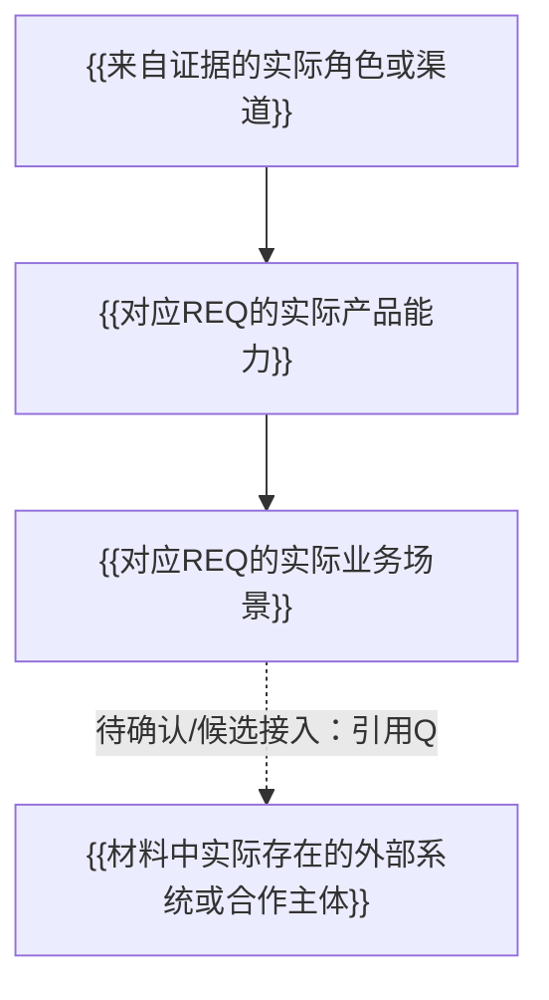
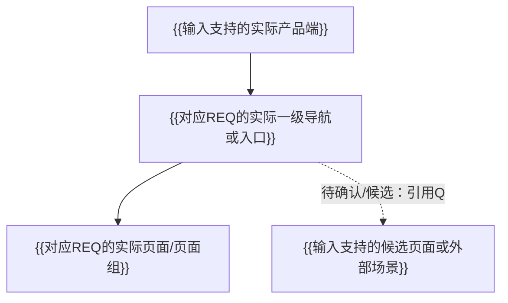

# 《需求池 + PRD 初稿》

## 一、需求范围说明

- 输入来源：
- 已确认范围：
- 待确认范围：
- 非范围/后续范围：

## 二、需求池

引用 `02_requirement_pool.csv` 或使用同字段表格。

## 三、产品架构

### 3.1 产品能力架构图

必须根据实际角色/渠道、产品公共能力、业务场景和外部依赖动态生成；不得保留占位符或预置输入未支持的模块。

图例：说明已确认主线与待确认/候选内容的视觉或连线区别。

### 3.2 架构分层说明

| 架构层 | 产品职责 | 对应REQ | 边界说明 |
|---|---|---|---|

### 3.3 产品架构原则与边界

- 仅输出由证据和需求支持的原则；
- 明确公共能力与原业务系统的职责边界；
- 明确待确认、产品建议和非范围内容；
- 不输出技术组件、部署拓扑或未经确认的接口能力。

### 3.4 产品导航与页面结构

#### 3.4.1 终端策略基线

- 终端数量与类型：
- 各端服务对象：
- 单端/多端依据：
- 载体冲突与条件性假设：

#### 3.4.2 产品导航树

必须根据实际终端、角色、需求和业务场景动态生成；不得保留占位符或预置固定导航。

#### 3.4.3 页面层级与页面清单

| 页面层级 | 页面/页面组 | 主要内容或任务 | 进入方式 | 适用角色/身份 | 对应REQ | 状态与边界 |
|---|---|---|---|---|---|---|

#### 3.4.4 角色/身份可见性矩阵

只列输入中实际存在的角色或可直接推导的身份状态。

| 导航/页面区域 | 角色或身份A | 角色或身份B | 角色或身份C | 可见性依据/限制 |
|---|---|---|---|---|

#### 3.4.5 核心页面流

按输入支持的关键任务输出：

`入口/导航 → 页面 → 操作 → 结果 → 后续页面或外部系统`

#### 3.4.6 导航与页面规则

- 说明导航数量、名称和顺序中哪些是已确认、哪些是产品建议；
- 说明角色/身份/权限/场景开通如何影响可见性；
- 说明候选接入、未开放系统和非范围页面的默认隐藏规则；
- 说明用户端与运营端、供应商端、内部办公端的边界；
- 说明产品终端与 H5/原生等技术承载方式的边界。

## 四、PRD 模块

### 4.X 模块/功能名称

#### 1. 功能目标

#### 2. 用户角色

#### 3. 使用场景

| 用户/角色 | 操作 | 系统/载体 | 结果 | 来源 |
|---|---|---|---|---|

#### 4. 功能点

| 功能点 | 描述 | 优先级 | 对应REQ | 来源 |
|---|---|---|---|---|

#### 5. 业务规则

无依据时写：`待确认`

#### 6. 数据需求

#### 7. 权限/身份需求

#### 8. 外部依赖

#### 9. 异常与边界

无依据时写：`待确认`

#### 10. 待确认事项

#### 11. 来源追溯

## 五、产品评审问题

## 六、优先级与范围说明
